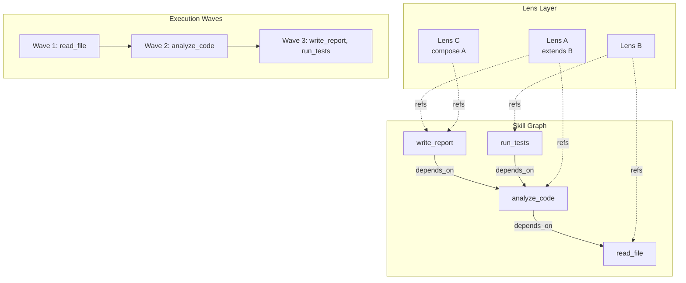

# RFC-087: Skill-Lens DAG (Unified Expertise Graph)

**Status:** Draft  
**Author:** AI Assistant  
**Created:** 2026-01-22  
**Updated:** 2026-01-22  
**Related:** RFC-011 (Agent Skills), RFC-036 (Artifact-First Planning), RFC-064 (Lens Management), RFC-067 (Integration-Aware DAG)

## Executive Summary

Sunwell currently treats skills as **embedded within lenses** — each lens declares its own skills, leading to duplication and no cross-lens reuse. Lens composition (`extends`/`compose`) exists but skill dependencies don't. This RFC proposes a **Unified Expertise Graph** where:

1. **Skills form their own DAG** — with explicit dependencies (`depends_on`)
2. **Lenses reference skills** — instead of embedding them
3. **Resolution is graph-aware** — loading a lens resolves the full skill subgraph
4. **Incremental execution applies** — skip skills that already ran

The key insight: **lenses and skills are another DAG problem** — just like artifacts and tasks.

---

## Problem

### Current State

```
Lens A                          Lens B
├── skill: read_file           ├── skill: read_file  ← DUPLICATE
├── skill: audit_code          ├── skill: run_tests
└── skill: write_report        └── skill: audit_code  ← DUPLICATE
```

**Issues:**

| Problem | Impact |
|---------|--------|
| **Skill duplication** | Same skill defined in multiple lenses |
| **No skill dependencies** | Can't say "audit_code requires read_file" |
| **No cross-lens references** | Can't import a skill from another lens |
| **No incremental execution** | Skill runs every time, even if unchanged |
| **Flat skill lists** | No execution order based on dependencies |

### Evidence from Codebase

```python
# src/sunwell/core/lens.py:214
skills: tuple[Skill, ...] = ()  # Skills embedded, not referenced

# src/sunwell/skills/types.py:128-139
@dataclass(frozen=True, slots=True)
class Skill:
    name: str
    description: str
    skill_type: SkillType
    # NO depends_on field
    # NO requires field for artifacts
```

```python
# src/sunwell/fount/resolver.py:129-133
# Skills are merged additively but NOT deduplicated by content:
existing_s = {s.name for s in skills}
for s in base.skills:
    if s.name not in existing_s:  # Name collision only
        skills.append(s)
```

### Existing Reference Pattern (Must Integrate)

The codebase already has a reference mechanism via `SkillType.REFERENCE`:

```python
# src/sunwell/skills/types.py:15-20
class SkillType(Enum):
    INLINE = "inline"      # Defined directly in lens file
    REFERENCE = "reference"  # External fount reference  ← EXISTS
    LOCAL = "local"        # Local folder with SKILL.md

# src/sunwell/skills/types.py:165-168
# For type: reference
source: str | None = None  # e.g., "fount://name@^1.0"
```

This RFC **extends** the existing reference pattern rather than replacing it.

---

## Goals

1. **Skills as first-class entities** — Independent of any single lens
2. **Skill dependencies** — Explicit `depends_on` for execution ordering
3. **Cross-lens skill references** — Extend existing `SkillType.REFERENCE`
4. **Incremental skill execution** — Skip unchanged skills
5. **Unified expertise graph** — Lenses + skills as a single DAG
6. **Backward compatible** — Embedded skills still work

## Non-Goals

1. **Replace embedded skills entirely** — Support both patterns
2. **Runtime skill discovery** — Focus on static resolution first
3. **Skill versioning** — Defer to lens versioning for now
4. **Distributed skill registry** — Local-first, Fount integration later

---

## Design

### Architecture Overview



### The Unified Expertise Graph

```
                    ┌─────────────────────────────────────┐
                    │        Unified Expertise Graph       │
                    └─────────────────────────────────────┘
                                      │
              ┌───────────────────────┼───────────────────────┐
              │                       │                       │
        ┌─────▼─────┐           ┌─────▼─────┐           ┌─────▼─────┐
        │  Lens A   │           │  Lens B   │           │  Lens C   │
        │ extends B │           │           │           │ compose A │
        └─────┬─────┘           └─────┬─────┘           └─────┬─────┘
              │                       │                       │
              │ refs                  │ refs                  │ refs
              ▼                       ▼                       ▼
        ┌─────────────────────────────────────────────────────────┐
        │                      Skill Graph                         │
        │  ┌──────────┐    ┌──────────┐    ┌──────────┐           │
        │  │read_file │◄───│audit_code│◄───│write_rpt │           │
        │  └──────────┘    └────┬─────┘    └──────────┘           │
        │                       │                                  │
        │                       ▼                                  │
        │                  ┌──────────┐                            │
        │                  │run_tests │                            │
        │                  └──────────┘                            │
        └─────────────────────────────────────────────────────────┘
```

### Data Model Changes

#### 1. Extend Skill with Dependencies

Rather than creating a separate `SkillReference` type, we extend the existing `Skill` dataclass:

```python
# src/sunwell/skills/types.py (updated)

@dataclass(frozen=True, slots=True)
class SkillDependency:
    """A dependency on another skill.
    
    Uses the same source format as SkillType.REFERENCE for consistency.
    
    Examples:
        - "read_file" → local skill in same lens
        - "sunwell/common:read_file" → skill from library
        - "fount://audit-skills@^1.0:validate_code" → versioned fount reference
    """
    
    source: str
    """Skill reference in format: [library:]skill_name or fount://..."""
    
    @property
    def is_local(self) -> bool:
        """True if this references a skill in the same lens."""
        return ":" not in self.source and "/" not in self.source
    
    @property
    def skill_name(self) -> str:
        """Extract skill name from reference."""
        if ":" in self.source:
            return self.source.split(":")[-1]
        return self.source
    
    @property
    def library(self) -> str | None:
        """Extract library name if external reference."""
        if ":" in self.source:
            return self.source.rsplit(":", 1)[0]
        return None


@dataclass(frozen=True, slots=True)
class Skill:
    """An agent skill that provides action capabilities.
    
    Skills define HOW to do something (instructions, scripts, templates)
    while lenses define HOW to judge the output (heuristics, validators).
    """
    
    # Required fields (existing)
    name: str
    description: str
    skill_type: SkillType
    
    # NEW: Skill dependencies for DAG ordering
    depends_on: tuple[SkillDependency, ...] = ()
    """Skills that must execute before this one.
    
    Dependencies form a DAG. Circular dependencies are detected at resolution time.
    """
    
    # NEW: Artifact flow for incremental execution
    produces: tuple[str, ...] = ()
    """Context keys this skill produces.
    
    These are keys in the execution context dict, NOT file paths.
    Example: ("code_analysis", "lint_results")
    
    Used for:
    1. Cache key computation (if produces change, invalidate)
    2. Dependency validation (requires must be subset of upstream produces)
    """
    
    requires: tuple[str, ...] = ()
    """Context keys this skill requires from upstream skills.
    
    Example: ("file_content",) means this skill needs the output
    from a skill that produces "file_content".
    
    Validated at resolution time: all requires must be satisfied
    by produces of skills in depends_on (transitively).
    """
    
    # Existing fields unchanged...
    triggers: tuple[str, ...] = ()
    compatibility: str | None = None
    allowed_tools: tuple[str, ...] = ()
    parameters_schema: dict | None = None
    instructions: str | None = None
    scripts: tuple[Script, ...] = ()
    templates: tuple[Template, ...] = ()
    resources: tuple[Resource, ...] = ()
    source: str | None = None
    path: str | None = None
    trust: TrustLevel = TrustLevel.SANDBOXED
    timeout: int = 30
    override: bool = False
    validate_with: SkillValidation = field(default_factory=SkillValidation)
```

#### 2. Lens with Skill Sources

```python
# src/sunwell/core/lens.py (updated)

@dataclass(slots=True)
class Lens:
    """The core expertise container."""
    
    metadata: LensMetadata
    extends: LensReference | None = None
    compose: tuple[LensReference, ...] = ()
    
    # UPDATED: Skills remain tuple[Skill, ...] for backward compatibility
    # SkillType.REFERENCE skills are resolved via skill_sources
    skills: tuple[Skill, ...] = ()
    
    # NEW: Skill library sources for resolving REFERENCE skills
    skill_sources: tuple[str, ...] = ()
    """Skill libraries to search when resolving SkillType.REFERENCE skills.
    
    Examples:
        - "sunwell/common" → built-in skill library
        - "./skills" → local project skills directory
        - "fount://my-skills@^1.0" → versioned fount package
    
    Resolution order: local skills first, then skill_sources in order.
    """
    
    # ... rest unchanged
```

#### 3. Skill Graph (New Module)

Following the proven `ArtifactGraph` pattern from `src/sunwell/naaru/artifacts.py`:

```python
# src/sunwell/skills/graph.py

from __future__ import annotations

import hashlib
import threading
from collections import deque
from dataclasses import dataclass, field
from typing import TYPE_CHECKING

if TYPE_CHECKING:
    from sunwell.skills.types import Skill


class SkillGraphError(Exception):
    """Base exception for skill graph errors."""
    pass


class CircularDependencyError(SkillGraphError):
    """Raised when skill dependencies form a cycle."""
    
    def __init__(self, cycle: list[str]) -> None:
        self.cycle = cycle
        cycle_str = " → ".join(cycle + [cycle[0]])
        super().__init__(f"Circular dependency detected: {cycle_str}")


class MissingDependencyError(SkillGraphError):
    """Raised when a skill depends on a non-existent skill."""
    
    def __init__(self, skill_name: str, missing: set[str]) -> None:
        self.skill_name = skill_name
        self.missing = missing
        super().__init__(
            f"Skill '{skill_name}' depends on non-existent skills: {missing}"
        )


class UnsatisfiedRequiresError(SkillGraphError):
    """Raised when a skill's requires aren't satisfied by upstream produces."""
    
    def __init__(self, skill_name: str, unsatisfied: set[str], available: set[str]) -> None:
        self.skill_name = skill_name
        self.unsatisfied = unsatisfied
        self.available = available
        super().__init__(
            f"Skill '{skill_name}' requires {unsatisfied} but upstream only produces {available}"
        )


@dataclass
class SkillGraph:
    """DAG of skills with dependency resolution.
    
    Thread-safe for concurrent reads. Mutations require external synchronization
    or should only happen during initial construction.
    
    Follows the same patterns as ArtifactGraph (src/sunwell/naaru/artifacts.py).
    """
    
    _skills: dict[str, Skill] = field(default_factory=dict)
    """Mapping from skill name to Skill object."""
    
    _edges: dict[str, frozenset[str]] = field(default_factory=dict)
    """Mapping from skill name to its dependencies (immutable for thread safety)."""
    
    _dependents: dict[str, set[str]] = field(default_factory=dict)
    """Reverse mapping: skill → skills that depend on it."""
    
    _lock: threading.Lock = field(default_factory=threading.Lock)
    """Lock for mutation operations."""
    
    def add_skill(self, skill: Skill) -> None:
        """Add a skill to the graph.
        
        Thread-safe: acquires lock during mutation.
        
        Args:
            skill: The skill to add
            
        Raises:
            ValueError: If skill name already exists
        """
        with self._lock:
            if skill.name in self._skills:
                raise ValueError(f"Skill '{skill.name}' already exists in graph")
            
            self._skills[skill.name] = skill
            deps = frozenset(dep.skill_name for dep in skill.depends_on)
            self._edges[skill.name] = deps
            
            # Update reverse mapping
            self._dependents.setdefault(skill.name, set())
            for dep_name in deps:
                self._dependents.setdefault(dep_name, set()).add(skill.name)
    
    def get(self, name: str) -> Skill | None:
        """Get a skill by name."""
        return self._skills.get(name)
    
    def __contains__(self, name: str) -> bool:
        return name in self._skills
    
    def __len__(self) -> int:
        return len(self._skills)
    
    @property
    def skills(self) -> dict[str, Skill]:
        """Read-only view of all skills."""
        return dict(self._skills)
    
    def validate(self) -> list[str]:
        """Validate the graph for completeness and consistency.
        
        Returns:
            List of validation errors (empty if valid)
        """
        errors = []
        
        # Check for missing dependencies
        for name, deps in self._edges.items():
            missing = deps - set(self._skills.keys())
            if missing:
                errors.append(f"Skill '{name}' depends on non-existent: {missing}")
        
        # Check for cycles
        try:
            self.topological_order()
        except CircularDependencyError as e:
            errors.append(str(e))
        
        # Validate requires/produces flow
        for name, skill in self._skills.items():
            if skill.requires:
                available = self._upstream_produces(name)
                unsatisfied = set(skill.requires) - available
                if unsatisfied:
                    errors.append(
                        f"Skill '{name}' requires {unsatisfied} not produced by dependencies"
                    )
        
        return errors
    
    def _upstream_produces(self, skill_name: str) -> set[str]:
        """Get all context keys produced by upstream skills (transitive)."""
        visited = set()
        produces = set()
        
        def visit(name: str) -> None:
            if name in visited:
                return
            visited.add(name)
            
            skill = self._skills.get(name)
            if skill:
                produces.update(skill.produces)
                for dep in self._edges.get(name, frozenset()):
                    visit(dep)
        
        # Visit all direct dependencies
        for dep in self._edges.get(skill_name, frozenset()):
            visit(dep)
        
        return produces
    
    def topological_order(self) -> list[str]:
        """Return skills in execution order (dependencies first).
        
        Uses Kahn's algorithm, same as ArtifactGraph.
        
        Returns:
            List of skill names in dependency order
            
        Raises:
            CircularDependencyError: If cycle detected
        """
        in_degree = {name: len(deps & set(self._skills.keys())) 
                     for name, deps in self._edges.items()}
        
        queue = deque([name for name, deg in in_degree.items() if deg == 0])
        order = []
        
        while queue:
            name = queue.popleft()
            order.append(name)
            
            for dependent in self._dependents.get(name, set()):
                in_degree[dependent] -= 1
                if in_degree[dependent] == 0:
                    queue.append(dependent)
        
        if len(order) != len(self._skills):
            # Find the cycle
            remaining = set(self._skills.keys()) - set(order)
            cycle = self._detect_cycle(remaining)
            raise CircularDependencyError(cycle or list(remaining)[:3])
        
        return order
    
    def _detect_cycle(self, nodes: set[str]) -> list[str] | None:
        """Detect cycle in a subset of nodes using DFS."""
        WHITE, GRAY, BLACK = 0, 1, 2
        color = dict.fromkeys(nodes, WHITE)
        parent: dict[str, str | None] = dict.fromkeys(nodes)
        
        def dfs(node: str) -> list[str] | None:
            color[node] = GRAY
            for dep in self._edges.get(node, frozenset()):
                if dep not in color:
                    continue
                if color[dep] == GRAY:
                    # Found cycle
                    cycle = [dep, node]
                    curr = parent.get(node)
                    while curr and curr != dep:
                        cycle.append(curr)
                        curr = parent.get(curr)
                    return list(reversed(cycle))
                if color[dep] == WHITE:
                    parent[dep] = node
                    if result := dfs(dep):
                        return result
            color[node] = BLACK
            return None
        
        for node in nodes:
            if color[node] == WHITE:
                if cycle := dfs(node):
                    return cycle
        return None
    
    def execution_waves(self) -> list[list[str]]:
        """Group skills into parallel execution waves.
        
        Each wave contains skills that can execute in parallel because
        all their dependencies are satisfied by previous waves.
        
        Returns:
            List of waves, each wave is a list of skill names
        """
        completed: set[str] = set()
        pending = set(self._skills.keys())
        waves = []
        
        while pending:
            wave = [
                name for name in pending
                if (self._edges.get(name, frozenset()) & set(self._skills.keys())).issubset(completed)
            ]
            
            if not wave:
                cycle = self._detect_cycle(pending)
                raise CircularDependencyError(cycle or list(pending)[:3])
            
            waves.append(wave)
            completed.update(wave)
            pending -= set(wave)
        
        return waves
    
    def subgraph_for(self, skill_names: set[str]) -> SkillGraph:
        """Extract subgraph containing specified skills and their dependencies.
        
        Args:
            skill_names: Skills to include (dependencies added automatically)
            
        Returns:
            New SkillGraph with only the required skills
        """
        needed: set[str] = set()
        to_visit = list(skill_names)
        
        while to_visit:
            name = to_visit.pop()
            if name in needed or name not in self._skills:
                continue
            needed.add(name)
            to_visit.extend(self._edges.get(name, frozenset()))
        
        subgraph = SkillGraph()
        for name in needed:
            subgraph.add_skill(self._skills[name])
        
        return subgraph
    
    def content_hash(self) -> str:
        """Compute a content hash for cache invalidation.
        
        Hash includes:
        - All skill names and their instruction content
        - Dependency structure
        - produces/requires declarations
        
        Returns:
            SHA-256 hex digest
        """
        hasher = hashlib.sha256()
        
        for name in sorted(self._skills.keys()):
            skill = self._skills[name]
            hasher.update(name.encode())
            hasher.update((skill.instructions or "").encode())
            hasher.update(",".join(sorted(skill.produces)).encode())
            hasher.update(",".join(sorted(skill.requires)).encode())
            hasher.update(",".join(sorted(d.source for d in skill.depends_on)).encode())
        
        return hasher.hexdigest()
    
    def to_mermaid(self) -> str:
        """Generate Mermaid diagram of the skill graph."""
        lines = ["graph TD"]
        
        for name, skill in self._skills.items():
            desc = skill.description[:30] + "..." if len(skill.description) > 30 else skill.description
            safe_desc = desc.replace('"', "'")
            lines.append(f'    {name}["{name}: {safe_desc}"]')
            
            for dep in self._edges.get(name, frozenset()):
                lines.append(f"    {dep} --> {name}")
        
        return "\n".join(lines)
```

#### 4. Unified Resolver (Updated)

```python
# src/sunwell/fount/resolver.py (updated)

from sunwell.skills.graph import SkillGraph, MissingDependencyError


@dataclass
class UnifiedResolver:
    """Resolves lenses AND their skill dependencies as a unified graph."""
    
    lens_loader: LensLoader
    skill_loader: SkillLoader
    _resolution_stack: list[str] = field(default_factory=list)
    
    async def resolve(self, ref: LensReference) -> tuple[Lens, SkillGraph]:
        """Resolve a lens and all its skill dependencies.
        
        Args:
            ref: Reference to the lens to resolve
            
        Returns:
            Tuple of (resolved Lens, SkillGraph with all required skills)
            
        Raises:
            LensResolutionError: If lens cannot be resolved
            MissingDependencyError: If skill dependency cannot be found
            CircularDependencyError: If skill dependencies form a cycle
        """
        # 1. Resolve lens hierarchy (existing logic)
        lens = await self._resolve_lens(ref)
        
        # 2. Build skill graph from resolved lens
        skill_graph = SkillGraph()
        resolution_errors: list[str] = []
        
        for skill in lens.skills:
            skill_graph.add_skill(skill)
            
            # Recursively resolve skill dependencies
            await self._resolve_skill_deps(
                skill, 
                skill_graph, 
                lens.skill_sources,
                resolution_errors
            )
        
        if resolution_errors:
            raise MissingDependencyError(
                lens.metadata.name,
                set(resolution_errors)
            )
        
        # 3. Validate the graph
        validation_errors = skill_graph.validate()
        if validation_errors:
            raise SkillGraphError(
                f"Skill graph validation failed:\n" + "\n".join(validation_errors)
            )
        
        return lens, skill_graph
    
    async def _resolve_skill_deps(
        self,
        skill: Skill,
        graph: SkillGraph,
        sources: tuple[str, ...],
        errors: list[str],
    ) -> None:
        """Recursively resolve skill dependencies.
        
        Args:
            skill: Skill whose dependencies to resolve
            graph: Graph to add resolved skills to
            sources: Skill sources for external resolution
            errors: List to append resolution errors to
        """
        for dep in skill.depends_on:
            if dep.skill_name in graph:
                continue  # Already resolved
            
            # Try to load the dependency
            try:
                if dep.is_local:
                    # Local skill must already be in the lens
                    errors.append(
                        f"Local skill '{dep.skill_name}' not found "
                        f"(required by '{skill.name}')"
                    )
                    continue
                
                dep_skill = await self.skill_loader.load(dep, sources)
                graph.add_skill(dep_skill)
                
                # Recurse
                await self._resolve_skill_deps(dep_skill, graph, sources, errors)
                
            except Exception as e:
                errors.append(
                    f"Failed to resolve '{dep.source}' "
                    f"(required by '{skill.name}'): {e}"
                )
```

---

## Cache Key Computation

Cache keys must uniquely identify a skill execution context:

```python
# src/sunwell/skills/cache.py

import hashlib
from dataclasses import dataclass
from typing import Any

from sunwell.skills.types import Skill


@dataclass(frozen=True, slots=True)
class SkillCacheKey:
    """Cache key for skill execution results.
    
    A skill result is valid if:
    1. Skill content hasn't changed (instruction, scripts, etc.)
    2. Input context matches (values of 'requires' keys)
    3. Lens version matches (optional, for strict caching)
    """
    
    skill_hash: str
    """SHA-256 of skill definition (instructions, scripts, templates)."""
    
    input_hash: str
    """SHA-256 of input context values (the 'requires' keys)."""
    
    lens_version: str | None = None
    """Optional lens version for strict cache invalidation."""
    
    @classmethod
    def compute(
        cls,
        skill: Skill,
        context: dict[str, Any],
        lens_version: str | None = None,
    ) -> "SkillCacheKey":
        """Compute cache key for a skill execution.
        
        Args:
            skill: The skill to execute
            context: Current execution context
            lens_version: Optional lens version
            
        Returns:
            Cache key for this execution
        """
        # Hash skill definition
        skill_hasher = hashlib.sha256()
        skill_hasher.update(skill.name.encode())
        skill_hasher.update((skill.instructions or "").encode())
        for script in skill.scripts:
            skill_hasher.update(script.content.encode())
        for template in skill.templates:
            skill_hasher.update(template.content.encode())
        skill_hash = skill_hasher.hexdigest()[:16]
        
        # Hash input context (only the keys this skill requires)
        input_hasher = hashlib.sha256()
        for key in sorted(skill.requires):
            value = context.get(key, "")
            # Hash the string representation (for complex objects)
            input_hasher.update(f"{key}={value!r}".encode())
        input_hash = input_hasher.hexdigest()[:16]
        
        return cls(
            skill_hash=skill_hash,
            input_hash=input_hash,
            lens_version=lens_version,
        )
    
    def __str__(self) -> str:
        """Human-readable cache key."""
        parts = [self.skill_hash, self.input_hash]
        if self.lens_version:
            parts.append(self.lens_version)
        return ":".join(parts)


class SkillCache:
    """LRU cache for skill execution results.
    
    Thread-safe via internal locking.
    """
    
    def __init__(self, max_size: int = 1000) -> None:
        self._cache: dict[str, Any] = {}
        self._lock = threading.Lock()
        self._max_size = max_size
    
    def get(self, key: SkillCacheKey) -> Any | None:
        """Get cached result or None."""
        with self._lock:
            return self._cache.get(str(key))
    
    def set(self, key: SkillCacheKey, value: Any) -> None:
        """Cache a result."""
        with self._lock:
            # Simple LRU: evict oldest if full
            if len(self._cache) >= self._max_size:
                oldest = next(iter(self._cache))
                del self._cache[oldest]
            self._cache[str(key)] = value
    
    def invalidate_skill(self, skill_name: str) -> int:
        """Invalidate all entries for a skill.
        
        Returns:
            Number of entries invalidated
        """
        with self._lock:
            keys_to_remove = [
                k for k in self._cache 
                if k.startswith(skill_name + ":")
            ]
            for k in keys_to_remove:
                del self._cache[k]
            return len(keys_to_remove)
    
    def clear(self) -> None:
        """Clear all cached results."""
        with self._lock:
            self._cache.clear()
```

---

## Error Handling

### Resolution Errors

| Error Type | Cause | Recovery |
|------------|-------|----------|
| `MissingDependencyError` | Skill depends on non-existent skill | Check skill_sources, add missing library |
| `CircularDependencyError` | A → B → C → A | Refactor skill dependencies |
| `UnsatisfiedRequiresError` | Skill needs context key not produced | Add dependency on skill that produces it |
| `SkillLoaderError` | External skill library unavailable | Check network, verify library exists |

### Execution Errors

```python
# src/sunwell/skills/executor.py

class SkillExecutionError(Exception):
    """Raised when skill execution fails."""
    
    def __init__(
        self,
        skill_name: str,
        phase: str,  # "setup", "execute", "validate"
        cause: Exception,
        recoverable: bool = False,
    ) -> None:
        self.skill_name = skill_name
        self.phase = phase
        self.cause = cause
        self.recoverable = recoverable
        super().__init__(
            f"Skill '{skill_name}' failed during {phase}: {cause}"
        )


class WaveExecutionError(Exception):
    """Raised when a parallel wave fails."""
    
    def __init__(self, wave_index: int, failures: list[SkillExecutionError]) -> None:
        self.wave_index = wave_index
        self.failures = failures
        names = [f.skill_name for f in failures]
        super().__init__(
            f"Wave {wave_index} failed: {len(failures)} skill(s) failed: {names}"
        )
```

---

## Example Usage

### Skill Library Definition

```yaml
# skills/common.skills.yaml
skills:
  - name: read-file
    type: inline
    description: "Read a file from the filesystem"
    instructions: "Read the specified file and return its contents"
    produces: ["file_content", "file_path"]
    
  - name: analyze-code
    type: inline
    description: "Analyze code structure and patterns"
    depends_on:
      - source: read-file
    instructions: "Analyze the code for patterns, complexity, and structure"
    requires: ["file_content"]
    produces: ["code_analysis", "complexity_score"]
    
  - name: audit-code
    type: inline
    description: "Audit code for quality issues"
    depends_on:
      - source: analyze-code
    instructions: "Check for bugs, security issues, and best practices"
    requires: ["code_analysis"]
    produces: ["audit_report", "issues_found"]
```

### Lens Referencing Skills

```yaml
# lenses/tech-writer.lens
lens:
  metadata:
    name: tech-writer
    domain: documentation
    version: 1.0.0
    
  skill_sources:
    - "sunwell/common"  # Built-in skill library
    
  skills:
    # Reference external skills (SkillType.REFERENCE)
    - name: read-file
      type: reference
      source: "sunwell/common:read-file"
      description: "Read file for documentation"
      
    - name: analyze-code
      type: reference  
      source: "sunwell/common:analyze-code"
      description: "Analyze code for documentation"
    
    # Define lens-specific skill with dependency
    - name: draft-doc
      type: inline
      description: "Draft documentation based on code analysis"
      depends_on:
        - source: analyze-code
      instructions: "Generate clear, comprehensive documentation"
      requires: ["code_analysis"]
      produces: ["draft_document", "doc_outline"]
```

### Resolution Result

```
Loading: tech-writer.lens
├── Resolving skill_sources: sunwell/common
├── Resolving skills:
│   ├── read-file (reference → sunwell/common:read-file) ✓
│   ├── analyze-code (reference → sunwell/common:analyze-code) ✓
│   │   └── depends_on: read-file ✓
│   └── draft-doc (inline)
│       └── depends_on: analyze-code ✓
│       └── requires: ["code_analysis"] ✓ (analyze-code produces it)

Skill Graph:
  Wave 1: [read-file]        # No dependencies
  Wave 2: [analyze-code]     # Depends on wave 1  
  Wave 3: [draft-doc]        # Depends on wave 2

Context Flow:
  read-file    → produces: [file_content, file_path]
  analyze-code → requires: [file_content] → produces: [code_analysis, complexity_score]
  draft-doc    → requires: [code_analysis] → produces: [draft_document, doc_outline]
```

---

## Incremental Execution

### Skip Unchanged Skills

```python
# src/sunwell/skills/executor.py

import asyncio
import threading
from dataclasses import dataclass, field

from sunwell.skills.cache import SkillCache, SkillCacheKey
from sunwell.skills.graph import SkillGraph
from sunwell.skills.types import Skill, SkillOutput


@dataclass
class ExecutionContext:
    """Shared context for skill execution."""
    
    data: dict[str, Any] = field(default_factory=dict)
    """Context data produced by skills (the 'produces' values)."""
    
    lens_version: str | None = None
    """Lens version for cache key computation."""
    
    _lock: threading.Lock = field(default_factory=threading.Lock)
    
    def get(self, key: str) -> Any:
        with self._lock:
            return self.data.get(key)
    
    def set(self, key: str, value: Any) -> None:
        with self._lock:
            self.data[key] = value
    
    def update(self, values: dict[str, Any]) -> None:
        with self._lock:
            self.data.update(values)


class IncrementalSkillExecutor:
    """Execute skills with caching and incremental updates."""
    
    def __init__(self, cache: SkillCache | None = None) -> None:
        self.cache = cache or SkillCache()
    
    async def execute(
        self,
        graph: SkillGraph,
        context: ExecutionContext,
    ) -> dict[str, SkillOutput]:
        """Execute skill graph, skipping cached results.
        
        Args:
            graph: Skill graph to execute
            context: Execution context
            
        Returns:
            Mapping of skill name to output
            
        Raises:
            WaveExecutionError: If any wave fails
        """
        results: dict[str, SkillOutput] = {}
        
        for wave_idx, wave in enumerate(graph.execution_waves()):
            wave_tasks = []
            wave_skills = []
            
            for skill_name in wave:
                skill = graph.get(skill_name)
                if skill is None:
                    continue
                
                # Check cache
                cache_key = SkillCacheKey.compute(
                    skill, 
                    context.data, 
                    context.lens_version
                )
                
                if cached := self.cache.get(cache_key):
                    results[skill_name] = cached
                    # Update context with cached produces
                    for key in skill.produces:
                        if key in cached.context:
                            context.set(key, cached.context[key])
                    continue
                
                wave_tasks.append(self._execute_skill(skill, context))
                wave_skills.append(skill)
            
            if not wave_tasks:
                continue
            
            # Execute wave in parallel
            wave_results = await asyncio.gather(*wave_tasks, return_exceptions=True)
            
            # Process results
            failures = []
            for skill, result in zip(wave_skills, wave_results, strict=True):
                if isinstance(result, Exception):
                    failures.append(SkillExecutionError(
                        skill.name, "execute", result, recoverable=False
                    ))
                    continue
                
                results[skill.name] = result
                
                # Update context with produces
                for key in skill.produces:
                    if key in result.context:
                        context.set(key, result.context[key])
                
                # Cache the result
                cache_key = SkillCacheKey.compute(
                    skill, context.data, context.lens_version
                )
                self.cache.set(cache_key, result)
            
            if failures:
                raise WaveExecutionError(wave_idx, failures)
        
        return results
    
    async def _execute_skill(
        self,
        skill: Skill,
        context: ExecutionContext,
    ) -> SkillOutput:
        """Execute a single skill."""
        # Implementation depends on skill type (inline, reference, local)
        # This is a placeholder for the actual execution logic
        ...
```

---

## Migration Path

### Phase 1: Add Skill Dependencies (Non-Breaking)

1. Add `depends_on`, `produces`, `requires` to `Skill` dataclass
2. Add `SkillDependency` type (not a new `SkillReference` - uses existing patterns)
3. Update `LensLoader` to parse new fields (optional fields, backward compatible)
4. Existing embedded skills continue to work with empty dependencies

**Risk**: None — all new fields are optional with sensible defaults.

### Phase 2: Add Skill Graph

1. Implement `SkillGraph` class in `src/sunwell/skills/graph.py`
2. Add validation for circular dependencies
3. Add `execution_waves()` for parallel execution
4. Integrate with existing `LensResolver` (optional skill graph building)

**Risk**: Low — graph building is opt-in, existing flows unchanged.

### Phase 3: Add Skill Libraries

1. Implement `SkillLoader` for external skill files
2. Add `skill_sources` to `Lens`
3. Define `sunwell/common` built-in skill library location
4. Update resolver to search skill_sources

**Risk**: Medium — introduces external dependencies. Mitigated by graceful fallback.

### Phase 4: Incremental Execution

1. Implement `SkillCache` with `SkillCacheKey`
2. Add cache key computation based on skill content + inputs
3. Update executor to check cache before execution
4. Add cache invalidation on skill content changes

**Risk**: Low — caching is transparent optimization, correctness preserved.

---

## Benefits

| Benefit | Before | After |
|---------|--------|-------|
| **Skill reuse** | Copy-paste between lenses | Import by reference |
| **Execution order** | Implicit (hope for the best) | Explicit DAG |
| **Parallel execution** | Sequential | Waves of parallel skills |
| **Caching** | None | Skip unchanged skills |
| **Debugging** | Flat list | Graph visualization (Mermaid) |
| **Composition** | Lens-level only | Lens + Skill graphs |
| **Validation** | Runtime errors | Resolution-time validation |

---

## Risks and Mitigations

| Risk | Mitigation |
|------|------------|
| **Circular dependencies** | Detect during resolution with clear error messages |
| **Version conflicts** | Use lens version for skill versioning initially |
| **Performance overhead** | Cache resolved graphs; lazy resolution |
| **Migration complexity** | Backward compatible — all new fields optional |
| **Thread safety** | Immutable edges (`frozenset`), locked mutations |
| **Cache staleness** | Content-based cache keys; explicit invalidation API |

---

## Success Metrics

1. **Skill deduplication**: Measure unique skills vs total skill references
2. **Execution time**: Compare sequential vs wave-parallel execution
3. **Cache hit rate**: Percentage of skills skipped due to caching
4. **Adoption**: Number of lenses using skill references vs embedded
5. **Resolution failures**: Track missing dependency errors to improve libraries

---

## Cross-Language Integration

This RFC spans three codebases: Python (core), TypeScript (Studio UI), and Rust (Tauri backend). All must be updated for full functionality.

### Type Synchronization

| Language | Location | Primary Types |
|----------|----------|---------------|
| **Python** | `src/sunwell/skills/` | `Skill`, `SkillDependency`, `SkillGraph` |
| **TypeScript** | `studio/src/lib/types.ts` | `LensSkill`, `SkillGraph`, `SkillWave` |
| **Rust** | `studio/src-tauri/src/writer.rs` | `LensSkill`, `SkillGraph`, `SkillWave` |

**Synchronization mechanism**: JSON schema generated from Python types (`scripts/generate_types.py`), validated in CI.

### TypeScript Types (Studio)

```typescript
// studio/src/lib/types.ts — ADD these types

/** Skill dependency reference. */
export interface SkillDependency {
  source: string;           // e.g., "sunwell/common:read-file"
  skillName: string;        // Extracted skill name
  isLocal: boolean;         // True if same-lens reference
}

/** Extended skill with DAG information. */
export interface LensSkill {
  id: string;
  name: string;
  shortcut: string;
  description: string;
  category: string;
  
  // NEW: DAG fields
  dependsOn: SkillDependency[];
  produces: string[];       // Context keys this skill outputs
  requires: string[];       // Context keys this skill needs
}

/** A wave of skills that can execute in parallel. */
export interface SkillWave {
  waveIndex: number;
  skills: string[];         // Skill names in this wave
  estimatedDurationMs?: number;
}

/** Complete skill graph for a lens. */
export interface SkillGraph {
  lensName: string;
  skills: Record<string, LensSkill>;
  waves: SkillWave[];
  contentHash: string;      // For cache invalidation
}

/** Cache status for a skill execution. */
export interface SkillCacheStatus {
  skillName: string;
  cacheHit: boolean;
  cacheKey: string;
  reason: 'content_match' | 'input_match' | 'invalidated' | 'no_cache';
}

/** Execution plan showing what will run vs skip. */
export interface SkillExecutionPlan {
  graph: SkillGraph;
  toExecute: string[];      // Skills that will run
  toSkip: string[];         // Skills with cache hits
  skipPercentage: number;   // 0-100
}
```

### Rust Types (Tauri Backend)

```rust
// studio/src-tauri/src/writer.rs — ADD these types

use std::collections::HashMap;

#[derive(Debug, Clone, Serialize, Deserialize)]
pub struct SkillDependency {
    pub source: String,
    #[serde(rename = "skillName")]
    pub skill_name: String,
    #[serde(rename = "isLocal")]
    pub is_local: bool,
}

#[derive(Debug, Clone, Serialize, Deserialize)]
pub struct LensSkill {
    pub id: String,
    pub name: String,
    pub shortcut: String,
    pub description: String,
    pub category: String,
    
    // NEW: DAG fields
    #[serde(default, rename = "dependsOn")]
    pub depends_on: Vec<SkillDependency>,
    #[serde(default)]
    pub produces: Vec<String>,
    #[serde(default)]
    pub requires: Vec<String>,
}

#[derive(Debug, Clone, Serialize, Deserialize)]
pub struct SkillWave {
    #[serde(rename = "waveIndex")]
    pub wave_index: u32,
    pub skills: Vec<String>,
    #[serde(skip_serializing_if = "Option::is_none", rename = "estimatedDurationMs")]
    pub estimated_duration_ms: Option<u64>,
}

#[derive(Debug, Clone, Serialize, Deserialize)]
pub struct SkillGraph {
    #[serde(rename = "lensName")]
    pub lens_name: String,
    pub skills: HashMap<String, LensSkill>,
    pub waves: Vec<SkillWave>,
    #[serde(rename = "contentHash")]
    pub content_hash: String,
}

#[derive(Debug, Clone, Serialize, Deserialize)]
pub struct SkillCacheStatus {
    #[serde(rename = "skillName")]
    pub skill_name: String,
    #[serde(rename = "cacheHit")]
    pub cache_hit: bool,
    #[serde(rename = "cacheKey")]
    pub cache_key: String,
    pub reason: String,
}

#[derive(Debug, Clone, Serialize, Deserialize)]
pub struct SkillExecutionPlan {
    pub graph: SkillGraph,
    #[serde(rename = "toExecute")]
    pub to_execute: Vec<String>,
    #[serde(rename = "toSkip")]
    pub to_skip: Vec<String>,
    #[serde(rename = "skipPercentage")]
    pub skip_percentage: f32,
}
```

### New Tauri Commands

```rust
// studio/src-tauri/src/writer.rs — ADD these commands

/// Get the resolved skill graph for a lens.
#[tauri::command]
pub async fn get_skill_graph(lens_name: String) -> Result<SkillGraph, String> {
    sunwell_command()
        .args(["lens", "skill-graph", &lens_name, "--json"])
        .output()
        .map_err(|e| format!("Failed to get skill graph: {}", e))
        .and_then(|out| {
            if out.status.success() {
                serde_json::from_slice(&out.stdout)
                    .map_err(|e| format!("Failed to parse skill graph: {}", e))
            } else {
                Err(String::from_utf8_lossy(&out.stderr).to_string())
            }
        })
}

/// Get execution plan with cache predictions.
#[tauri::command]
pub async fn get_skill_execution_plan(
    lens_name: String,
    context_hash: Option<String>,
) -> Result<SkillExecutionPlan, String> {
    let mut cmd = sunwell_command();
    cmd.args(["lens", "skill-plan", &lens_name, "--json"]);
    
    if let Some(hash) = context_hash {
        cmd.args(["--context-hash", &hash]);
    }
    
    cmd.output()
        .map_err(|e| format!("Failed to get execution plan: {}", e))
        .and_then(|out| {
            if out.status.success() {
                serde_json::from_slice(&out.stdout)
                    .map_err(|e| format!("Failed to parse execution plan: {}", e))
            } else {
                Err(String::from_utf8_lossy(&out.stderr).to_string())
            }
        })
}

// Register in main.rs:
// writer::get_skill_graph,
// writer::get_skill_execution_plan,
```

### Agent Events

New events for skill graph execution:

```typescript
// schemas/agent-events.schema.json — ADD these event types

interface SkillGraphResolvedEvent {
  type: 'skill_graph_resolved';
  data: {
    lens_name: string;
    skill_count: number;
    wave_count: number;
    content_hash: string;
  };
}

interface SkillWaveStartEvent {
  type: 'skill_wave_start';
  data: {
    wave_index: number;
    total_waves: number;
    skills: string[];
    parallel: boolean;
  };
}

interface SkillWaveCompleteEvent {
  type: 'skill_wave_complete';
  data: {
    wave_index: number;
    duration_ms: number;
    succeeded: string[];
    failed: string[];
  };
}

interface SkillCacheHitEvent {
  type: 'skill_cache_hit';
  data: {
    skill_name: string;
    cache_key: string;
    saved_ms: number;  // Estimated time saved
  };
}

interface SkillExecuteStartEvent {
  type: 'skill_execute_start';
  data: {
    skill_name: string;
    wave_index: number;
    requires: string[];
    context_keys_available: string[];
  };
}

interface SkillExecuteCompleteEvent {
  type: 'skill_execute_complete';
  data: {
    skill_name: string;
    duration_ms: number;
    produces: string[];
    cached: boolean;
    success: boolean;
    error?: string;
  };
}
```

### Event Handling in Studio

```typescript
// studio/src/stores/agent.svelte.ts — ADD to handleAgentEvent()

case 'skill_graph_resolved': {
  const lensName = (data.lens_name as string) ?? '';
  const skillCount = (data.skill_count as number) ?? 0;
  const waveCount = (data.wave_count as number) ?? 0;
  _state = {
    ..._state,
    learnings: [
      ..._state.learnings,
      `🔧 Skill graph: ${skillCount} skills in ${waveCount} waves`,
    ],
  };
  // Update skill graph store (new store needed)
  setSkillGraph(data as SkillGraph);
  break;
}

case 'skill_wave_start': {
  const waveIndex = (data.wave_index as number) ?? 0;
  const totalWaves = (data.total_waves as number) ?? 1;
  const skills = (data.skills as string[]) ?? [];
  _state = {
    ..._state,
    learnings: [
      ..._state.learnings,
      `⚡ Wave ${waveIndex + 1}/${totalWaves}: ${skills.join(', ')}`,
    ],
  };
  break;
}

case 'skill_cache_hit': {
  const skillName = (data.skill_name as string) ?? '';
  const savedMs = (data.saved_ms as number) ?? 0;
  _state = {
    ..._state,
    learnings: [
      ..._state.learnings,
      `💨 Cache hit: ${skillName} (saved ~${savedMs}ms)`,
    ],
  };
  break;
}

case 'skill_execute_complete': {
  const skillName = (data.skill_name as string) ?? '';
  const durationMs = (data.duration_ms as number) ?? 0;
  const success = (data.success as boolean) ?? true;
  const icon = success ? '✅' : '❌';
  _state = {
    ..._state,
    learnings: [
      ..._state.learnings,
      `${icon} Skill ${skillName}: ${durationMs}ms`,
    ],
  };
  break;
}
```

### Studio UI Components

#### SkillGraphView.svelte (New)

```svelte
<!--
  SkillGraphView.svelte — Visualize skill DAG
  
  Similar to artifact DAG but for skills.
  Shows dependencies, waves, and cache status.
-->
<script lang="ts">
  import { skillGraphState } from '../../stores';
  import type { SkillGraph, SkillWave } from '$lib/types';
  
  const graph = $derived(skillGraphState.graph);
  const executionPlan = $derived(skillGraphState.executionPlan);
  
  function getSkillStatus(skillName: string): 'pending' | 'running' | 'complete' | 'skipped' {
    if (executionPlan?.toSkip.includes(skillName)) return 'skipped';
    // ... check execution state
    return 'pending';
  }
</script>

<div class="skill-graph">
  {#if graph}
    <div class="header">
      <span class="title">🔧 Skill Graph</span>
      <span class="stats">
        {Object.keys(graph.skills).length} skills • 
        {graph.waves.length} waves
      </span>
    </div>
    
    <div class="waves">
      {#each graph.waves as wave, i}
        <div class="wave" class:current={/* check if running */}>
          <div class="wave-header">Wave {i + 1}</div>
          <div class="wave-skills">
            {#each wave.skills as skillName}
              {@const skill = graph.skills[skillName]}
              {@const status = getSkillStatus(skillName)}
              <div class="skill" class:skipped={status === 'skipped'}>
                <span class="name">{skill.name}</span>
                {#if status === 'skipped'}
                  <span class="badge cache">cached</span>
                {/if}
              </div>
            {/each}
          </div>
        </div>
      {/each}
    </div>
    
    {#if executionPlan && executionPlan.skipPercentage > 0}
      <div class="cache-summary">
        💨 {executionPlan.skipPercentage.toFixed(0)}% cached 
        ({executionPlan.toSkip.length} skills)
      </div>
    {/if}
  {:else}
    <div class="empty">No skill graph loaded</div>
  {/if}
</div>
```

#### Updated SkillsBlock.svelte

```svelte
<!--
  SkillsBlock.svelte — Updated with wave grouping
-->
<script lang="ts">
  // ... existing imports
  import { skillGraphState } from '../../stores';
  
  const graph = $derived(skillGraphState.graph);
  
  // Group skills by wave instead of category
  const groupedByWave = $derived(() => {
    if (!graph) return null;
    return graph.waves.map((wave, i) => ({
      label: `Wave ${i + 1}`,
      skills: wave.skills.map(name => graph.skills[name]).filter(Boolean),
    }));
  });
</script>

<!-- Show wave-based grouping when graph available -->
{#if groupedByWave}
  <div class="wave-groups">
    {#each groupedByWave as group}
      <div class="wave-group">
        <div class="wave-label">{group.label}</div>
        {#each group.skills as skill}
          <button class="skill-row" onclick={() => handleSkillClick(skill)}>
            <span class="name">{skill.name}</span>
            {#if skill.dependsOn.length > 0}
              <span class="deps" title={skill.dependsOn.map(d => d.skillName).join(', ')}>
                ← {skill.dependsOn.length}
              </span>
            {/if}
          </button>
        {/each}
      </div>
    {/each}
  </div>
{:else}
  <!-- Fallback to category grouping (existing code) -->
{/if}
```

### New Svelte Store

```typescript
// studio/src/stores/skill-graph.svelte.ts — NEW FILE

import type { SkillGraph, SkillExecutionPlan, SkillCacheStatus } from '$lib/types';

interface SkillGraphState {
  graph: SkillGraph | null;
  executionPlan: SkillExecutionPlan | null;
  cacheStatuses: Map<string, SkillCacheStatus>;
  currentWave: number;
  isExecuting: boolean;
}

const initialState: SkillGraphState = {
  graph: null,
  executionPlan: null,
  cacheStatuses: new Map(),
  currentWave: -1,
  isExecuting: false,
};

let _state = $state<SkillGraphState>({ ...initialState });

export const skillGraphState = {
  get graph() { return _state.graph; },
  get executionPlan() { return _state.executionPlan; },
  get cacheStatuses() { return _state.cacheStatuses; },
  get currentWave() { return _state.currentWave; },
  get isExecuting() { return _state.isExecuting; },
  
  get cacheHitRate() {
    if (!_state.executionPlan) return 0;
    const total = _state.executionPlan.toExecute.length + _state.executionPlan.toSkip.length;
    return total > 0 ? _state.executionPlan.toSkip.length / total : 0;
  },
};

export function setSkillGraph(graph: SkillGraph): void {
  _state = { ..._state, graph };
}

export function setExecutionPlan(plan: SkillExecutionPlan): void {
  _state = { ..._state, executionPlan: plan };
}

export function setCurrentWave(wave: number): void {
  _state = { ..._state, currentWave: wave };
}

export function addCacheStatus(status: SkillCacheStatus): void {
  const newStatuses = new Map(_state.cacheStatuses);
  newStatuses.set(status.skillName, status);
  _state = { ..._state, cacheStatuses: newStatuses };
}

export function resetSkillGraph(): void {
  _state = { ...initialState };
}
```

---

## Updated Migration Path

### Phase 1: Add Skill Dependencies (Non-Breaking)

1. Add `depends_on`, `produces`, `requires` to `Skill` dataclass
2. Add `SkillDependency` type (not a new `SkillReference` - uses existing patterns)
3. Update `LensLoader` to parse new fields (optional fields, backward compatible)
4. Existing embedded skills continue to work with empty dependencies

**Risk**: None — all new fields are optional with sensible defaults.

### Phase 2: Add Skill Graph

1. Implement `SkillGraph` class in `src/sunwell/skills/graph.py`
2. Add validation for circular dependencies
3. Add `execution_waves()` for parallel execution
4. Integrate with existing `LensResolver` (optional skill graph building)

**Risk**: Low — graph building is opt-in, existing flows unchanged.

### Phase 3: Add Skill Libraries

1. Implement `SkillLoader` for external skill files
2. Add `skill_sources` to `Lens`
3. Define `sunwell/common` built-in skill library location
4. Update resolver to search skill_sources

**Risk**: Medium — introduces external dependencies. Mitigated by graceful fallback.

### Phase 4: Incremental Execution

1. Implement `SkillCache` with `SkillCacheKey`
2. Add cache key computation based on skill content + inputs
3. Update executor to check cache before execution
4. Add cache invalidation on skill content changes

**Risk**: Low — caching is transparent optimization, correctness preserved.

### Phase 5: Studio Integration (NEW)

1. **TypeScript types**: Add `SkillGraph`, `SkillWave`, `SkillExecutionPlan` to `types.ts`
2. **Rust types**: Add corresponding structs to `writer.rs`
3. **Tauri commands**: Add `get_skill_graph`, `get_skill_execution_plan`
4. **Agent events**: Add `skill_graph_resolved`, `skill_wave_*`, `skill_cache_hit`
5. **Svelte store**: Create `skill-graph.svelte.ts`
6. **UI components**: Create `SkillGraphView.svelte`, update `SkillsBlock.svelte`
7. **Event handling**: Update `agent.svelte.ts` with skill event handlers

**Risk**: Medium — requires coordination across three languages. Mitigated by JSON schema validation.

### Phase 6: CLI Enhancements

1. Add `sunwell skills list [library]` — list available skills
2. Add `sunwell skills show <skill>` — show skill details with dependencies
3. Add `sunwell lens skill-graph <lens>` — output skill graph as JSON/Mermaid
4. Add `sunwell lens skill-plan <lens>` — show execution plan with cache predictions

**Risk**: Low — CLI additions are additive.

---

## Open Questions

1. **Skill versioning**: Should skills have independent versions, or use lens version?
   - **Proposal**: Use lens version initially; add skill versions in Phase 7 if needed.

2. **Skill discovery**: How do users find available skills? CLI? Studio?
   - **Proposal**: Add `sunwell skills list [library]` CLI command + Studio Library tab.

3. **Skill testing**: How do we test skills in isolation?
   - **Proposal**: Skills with `produces`/`requires` can be tested with mock context.

4. **Cross-project skills**: Can project A use skills from project B?
   - **Proposal**: Via Fount references (`fount://project-b-skills@^1.0:skill-name`).

5. **Type sync automation**: How do we keep Python/TypeScript/Rust types in sync?
   - **Proposal**: Generate TypeScript and Rust from Python via `scripts/generate_types.py`, validate in CI.

---

## References

- RFC-011: Agent Skills integration
- RFC-036: Artifact-First Planning (ArtifactGraph pattern)
- RFC-064: Lens Management
- RFC-067: Integration-Aware DAG
- `src/sunwell/skills/types.py`: Current Skill implementation
- `src/sunwell/fount/resolver.py:129-133`: Current skill merging logic
- `src/sunwell/naaru/artifacts.py`: ArtifactGraph (pattern followed)
