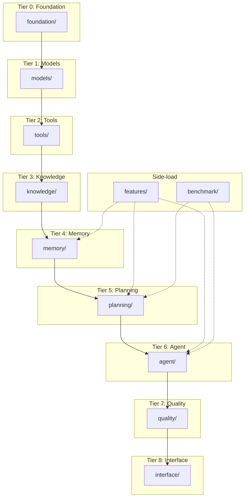

# RFC-138: Module Architecture Consolidation

**RFC Status**: Draft  
**Author**: Architecture Team  
**Created**: 2026-01-25  
**Updated**: 2026-01-25  
**Related**: RFC-110 (Agent Simplification), RFC-135 (Unified Chat-Agent)

---

## Executive Summary

Sunwell has grown organically to **60+ top-level modules** with **602 source files**. While the code is RFC-driven and uses proper import hygiene (200 files with `TYPE_CHECKING` guards), the flat structure creates:

- **Cognitive overload**: New contributors can't find where things live
- **Unclear boundaries**: Is `reasoning/` different from `routing/`? Where does `intelligence/` vs `analysis/` fit?
- **Hidden features**: Capabilities like `vortex`, `mirror`, `fount` exist but users can't discover them
- **Undertested modules**: ~30 modules have no direct test file

**Current**: 60+ flat directories, responsibility unclear from names alone

**Proposed**: **10 domain-based packages** with clear responsibilities and clean import hierarchy

```
BEFORE                              AFTER
├── agent/                          ├── foundation/     # Zero-dep base
├── analysis/                       ├── models/         # LLM abstraction
├── autonomous/                     ├── tools/          # Tool system
├── backlog/                        ├── knowledge/      # Codebase understanding
├── benchmark/                      ├── memory/         # Persistent state
├── binding/                        ├── planning/       # Intent → Plan
├── bootstrap/                      ├── agent/          # Core execution
├── chat/                           ├── quality/        # Verification & safety
├── cli/                            ├── interface/      # CLI, Server, UI
├── ... (50+ more)                  ├── features/       # Opt-in capabilities
└── workspace/                      └── benchmark/      # Eval infrastructure
```

---

## 🎯 Goals

| Goal | Benefit |
|------|---------|
| **Clear domain boundaries** | New contributors can navigate codebase |
| **Discoverable features** | Users find capabilities via `features/` |
| **Clean import hierarchy** | `foundation/` → `models/` → `tools/` → ... |
| **Reduced surface area** | 60+ dirs → 10 domains |
| **Archivable experiments** | `naaru/experiments/` shipped or archived |
| **Backward compatible** | Re-exports maintain existing imports during migration |

---

## 🚫 Non-Goals

| Non-Goal | Rationale |
|----------|-----------|
| Rewrite any functionality | This is purely organizational |
| Change public APIs | Only import paths change |
| Remove any shipped features | Archive only unshipped experiments |
| Break existing tests | Maintain compatibility via re-exports |

---

## Current State Analysis

### Module Count by Category

| Category | Count | Examples |
|----------|-------|----------|
| Core execution | 5 | `agent/`, `context/`, `convergence/`, `recovery/`, `chat/` |
| Planning | 6 | `naaru/`, `routing/`, `reasoning/`, `skills/`, `workflow/`, `backlog/` |
| Knowledge | 8 | `analysis/`, `indexing/`, `workspace/`, `project/`, `embedding/`, `navigation/`, `intelligence/`, `bootstrap/` |
| Memory | 4 | `memory/`, `simulacrum/`, `lineage/`, `session/` |
| Quality | 5 | `verification/`, `guardrails/`, `security/`, `confidence/`, `weakness/` |
| Infrastructure | 8 | `types/`, `core/`, `config.py`, `models/`, `providers/`, `tools/`, `schema/`, `binding/` |
| Interface | 4 | `cli/`, `server/`, `surface/`, `interface/` |
| Features | 7 | `vortex/`, `mirror/`, `fount/`, `team/`, `external/`, `autonomous/`, `self/` |
| Eval | 3 | `benchmark/`, `demo/`, `eval/` |
| Other | 10+ | `incremental/`, `runtime/`, `parallel/`, `execution/`, `prefetch/`, `extraction/`, `identity/`, `lens/`, `environment/`, `integration/` |

### Import Hierarchy Issues

Current imports are **mostly correct** (no circular imports detected), but the flat structure means:

```python
# These are all peers, but have very different abstraction levels:
from sunwell.foundation.types import ...        # Tier 0: Base types
from sunwell.models import ...       # Tier 1: LLM abstraction
from sunwell.agent import ...        # Tier 5: High-level execution
from sunwell.vortex import ...       # Feature: Optional capability
```

### Undertested Modules

The following modules have **no direct test file** (`test_<module>.py`):

```
agent, analysis, autonomous, benchmark, bootstrap, chat, cli,
context, convergence, environment, execution, external, extraction,
incremental, indexing, intelligence, lens, lineage, memory, mirror,
models, naaru, navigation, prefetch, project, reasoning, recovery,
routing, runtime, schema, security, self, server, session, skills,
surface, team, tools, verification, vortex, weakness, workflow, workspace
```

Some are tested via integration tests, but coverage is unclear.

---

## Proposed Architecture

### Domain 1: `foundation/` — Zero-Dependency Base

**Purpose**: Types, config, errors, identity — no sunwell imports

| Current | Proposed |
|---------|----------|
| `types/` | `foundation/types/` |
| `config.py` | `foundation/config.py` |
| `core/errors.py` | `foundation/errors.py` |
| `core/identity.py` | `foundation/identity.py` |
| `core/freethreading.py` | `foundation/freethreading.py` |
| `schema/` | `foundation/schema/` |
| `binding/` | `foundation/binding/` |
| (new) | `foundation/utils/` — Generic utilities |

**Import rule**: Only stdlib + third-party. Everything else imports from here.

**Utilities**: Generic utilities (string manipulation, validation, generic hashing) belong in `foundation/utils/`. Domain-specific utilities stay in their domains (e.g., `agent/incremental/hasher.py` for artifact hashing). See `RFC-138-UTILS-ANALYSIS.md` for detailed rationale.

```python
# foundation/__init__.py
from foundation.types import ...
from foundation.config import SunwellConfig, get_config
from foundation.errors import SunwellError, ErrorCode
from foundation.utils import slugify, validate_slug  # Generic utilities
```

---

### Domain 2: `models/` — LLM Abstraction

**Purpose**: Model protocols, providers, capability detection

| Current | Action |
|---------|--------|
| `models/` | Keep, reorganize |
| `providers/` | **Merge into** `models/providers/` |

```
models/
├── __init__.py
├── protocol.py          # ModelProtocol, ToolCall, etc.
├── capability/          # Tool capability detection (from models/capability/)
├── providers/
│   ├── anthropic.py
│   ├── ollama.py
│   └── openai.py
└── tool_emulator.py
```

---

### Domain 3: `tools/` — Tool System

**Purpose**: Tool definitions, handlers, execution

**Action**: Keep as-is — already well-organized

```
tools/
├── __init__.py
├── builtins.py
├── executor.py
├── handlers/
│   ├── base.py
│   ├── file.py
│   ├── git.py
│   ├── shell.py
│   └── env.py
├── progressive.py
└── types.py
```

---

### Domain 4: `knowledge/` — Understanding Codebases

**Purpose**: All modules that help understand code, projects, and workspaces

| Current | Proposed |
|---------|----------|
| `analysis/` | `knowledge/analysis/` |
| `indexing/` | `knowledge/indexing/` |
| `workspace/` | `knowledge/workspace/` |
| `project/` | `knowledge/project/` |
| `bootstrap/` | `knowledge/bootstrap/` |
| `embedding/` | `knowledge/embedding/` |
| `navigation/` | `knowledge/navigation/` |
| `intelligence/` | `knowledge/codebase/` (rename for clarity) |
| `environment/` | `knowledge/environment/` |
| `extraction/` | **Delete** if unused, else `knowledge/extraction/` |

```
knowledge/
├── __init__.py
├── analysis/       # State DAG, code scanning
├── indexing/       # Codebase indexing
├── workspace/      # Workspace detection
├── project/        # Project inference, monorepo
├── bootstrap/      # Fast project bootstrap
├── embedding/      # Vector embeddings
├── navigation/     # ToC navigation
├── codebase/       # (renamed from intelligence/)
└── environment/    # User environment model
```

---

### Domain 5: `memory/` — Persistent State

**Purpose**: Everything about remembering past interactions

| Current | Proposed |
|---------|----------|
| `memory/` | `memory/` (keep at root) |
| `simulacrum/` | `memory/simulacrum/` |
| `lineage/` | `memory/lineage/` |
| `session/` | `memory/session/` |

```
memory/
├── __init__.py
├── persistent.py    # PersistentMemory facade
├── briefing.py
├── types.py
├── simulacrum/      # Conversation memory, topology
├── lineage/         # Artifact tracking
└── session/         # Session tracking
```

---

### Domain 6: `planning/` — Intent → Plan

**Purpose**: Routing, reasoning, planning, skills, lens management

| Current | Proposed |
|---------|----------|
| `routing/` | `planning/routing/` |
| `reasoning/` | `planning/reasoning/` |
| `naaru/` (minus experiments) | `planning/naaru/` |
| `skills/` | `planning/skills/` |
| `lens/` | `planning/lens/` |
| `naaru/experiments/` | **Archive** to `archive/naaru-experiments/` |

```
planning/
├── __init__.py
├── routing/         # Intent classification, unified router
├── reasoning/       # Fast classification
├── naaru/
│   ├── planners/    # Harmonic, artifact, agent planners
│   ├── workers/
│   ├── artifacts.py
│   ├── checkpoint.py
│   └── types.py
├── skills/          # Skill definitions, composition
└── lens/            # Lens management (LensManager, versioning)
```

**Note**: The 11 files in `naaru/experiments/` (cellular, dialectic, strain, etc.) should be evaluated and either:
- Shipped as part of `planning/naaru/`
- Archived to `archive/naaru-experiments/`

---

### Domain 7: `agent/` — Core Execution

**Purpose**: THE execution engine

| Current | Proposed |
|---------|----------|
| `agent/` | Keep at root |
| `context/` | **Merge into** `agent/context/` |
| `convergence/` | **Merge into** `agent/convergence/` |
| `recovery/` | **Merge into** `agent/recovery/` |
| `prefetch/` | **Merge into** `agent/prefetch/` |
| `chat/` | **Merge into** `agent/chat/` (per RFC-135) |
| `incremental/` | **Merge into** `agent/incremental/` |
| `execution/` | **Merge into** `agent/execution/` |
| `runtime/` | **Merge into** `agent/runtime/` |
| `parallel/` | **Merge into** `agent/parallel/` |

```
agent/
├── __init__.py
├── core.py          # Agent class
├── loop.py          # AgentLoop
├── events.py
├── context/         # SessionContext (from context/)
├── convergence/     # Self-stabilizing loops (from convergence/)
├── recovery/        # Error recovery (from recovery/)
├── prefetch/        # Prefetching (from prefetch/)
├── chat/            # Chat loop (from chat/, per RFC-135)
├── execution/       # Execution management (from execution/)
├── runtime/         # Runtime management (from runtime/)
├── parallel/        # Parallel execution (from parallel/)
├── incremental/     # Incremental execution (from incremental/)
├── gates.py
├── validation.py
├── fixer.py
├── signals.py
├── thinking.py
├── renderer.py
├── spawn.py
├── introspection.py
└── ...
```

---

### Domain 8: `quality/` — Verification & Safety

**Purpose**: All quality assurance modules

| Current | Proposed |
|---------|----------|
| `verification/` | `quality/verification/` |
| `guardrails/` | `quality/guardrails/` |
| `security/` | `quality/security/` |
| `confidence/` | `quality/confidence/` |
| `weakness/` | `quality/weakness/` |

```
quality/
├── __init__.py
├── verification/    # Deep verification
├── guardrails/      # Safety guardrails
├── security/        # Permission analysis, sandbox
├── confidence/      # Confidence scoring
└── weakness/        # Weakness detection
```

---

### Domain 9: `interface/` — User-Facing

**Purpose**: CLI, Server, UI primitives

| Current | Proposed |
|---------|----------|
| `cli/` | `interface/cli/` |
| `server/` | `interface/server/` |
| `surface/` | `interface/surface/` |
| `interface/` | `interface/generative/` (rename to avoid confusion) |

```
interface/
├── __init__.py
├── cli/             # Command line interface
├── server/          # HTTP API for Studio
├── surface/         # UI primitives
└── generative/      # Generative interface (renamed from interface/)
```

---

### Domain 10: `features/` — Specialized Capabilities

**Purpose**: Opt-in features that don't fit elsewhere

| Current | Proposed |
|---------|----------|
| `vortex/` | `features/vortex/` — Multi-model coordination |
| `mirror/` | `features/mirror/` — Self-introspection |
| `fount/` | `features/fount/` — Lens distribution |
| `team/` | `features/team/` — Team intelligence |
| `external/` | `features/external/` — GitHub, Linear, Sentry |
| `backlog/` | `features/backlog/` — Autonomous backlog |
| `autonomous/` | `features/autonomous/` — Autonomous mode |
| `workflow/` | `features/workflow/` — Workflow execution |
| `self/` | **Merge into** `features/mirror/` |
| `integration/` | **Merge into** `features/external/` or delete |

```
features/
├── __init__.py
├── vortex/          # Multi-model coordination primitives
├── mirror/          # Self-introspection, self-knowledge
├── fount/           # Lens distribution client
├── team/            # Team intelligence
├── external/        # External integrations
├── backlog/         # Autonomous backlog
├── autonomous/      # Autonomous mode
└── workflow/        # Workflow execution
```

---

### Remaining at Root: `benchmark/`

**Purpose**: Evaluation and benchmarking infrastructure

| Current | Proposed |
|---------|----------|
| `benchmark/` | Keep at root |
| `demo/` | **Merge into** `benchmark/demo/` |
| `eval/` | **Merge into** `benchmark/eval/` |

```
benchmark/
├── __init__.py
├── runner.py
├── evaluator.py
├── demo/            # Demo infrastructure (from demo/)
├── eval/            # Evaluation suite (from eval/)
└── naaru/           # Naaru-specific benchmarks
```

---

### Archive: `archive/`

**Purpose**: Code that's built but not wired up

| Current | Action |
|---------|--------|
| `naaru/experiments/` (11 files) | **Move to** `archive/naaru-experiments/` |
| `archive/experiments_20260121/` | Keep in archive |

**Rationale**: The 11 experimental planners in `naaru/experiments/` (cellular, dialectic, strain, consensus, speculative, cascade, escalation, signals, streams, content_validation) have no clear path to production. Archive them to reduce cognitive load.

**Note**: `lens/` is NOT archived — it moves to `planning/lens/`. The `core/lens.py` data model stays in `foundation/core/`.

---

## Import Hierarchy

The new structure enforces a clean import hierarchy:

```
┌─────────────────┐
│   foundation/   │  Tier 0: Types, config, errors (no sunwell imports)
└────────┬────────┘
         ↓
┌─────────────────┐
│    models/      │  Tier 1: LLM abstraction
└────────┬────────┘
         ↓
┌─────────────────┐
│     tools/      │  Tier 2: Tool system
└────────┬────────┘
         ↓
┌─────────────────┐
│   knowledge/    │  Tier 3: Codebase understanding
└────────┬────────┘
         ↓
┌─────────────────┐
│    memory/      │  Tier 4: Persistent state
└────────┬────────┘
         ↓
┌─────────────────┐
│   planning/     │  Tier 5: Intent → Plan
└────────┬────────┘
         ↓
┌─────────────────┐
│     agent/      │  Tier 6: Core execution
└────────┬────────┘
         ↓
┌─────────────────┐
│    quality/     │  Tier 7: Verification & safety
└────────┬────────┘
         ↓
┌─────────────────┐
│   interface/    │  Tier 8: User-facing (CLI, Server)
└─────────────────┘

┌─────────────────┐
│   features/     │  Side-load: Opt-in capabilities (any tier)
└─────────────────┘

┌─────────────────┐
│   benchmark/    │  Side-load: Evaluation (imports all)
└─────────────────┘
```

**Rule**: Higher tiers can import from lower tiers, not vice versa.

---

## Migration Strategy

### Phase 1: Create Structure (Week 1)

1. Create domain directories with `__init__.py`
2. Add re-exports for backward compatibility
3. No code moves yet — just scaffolding

```python
# sunwell/knowledge/__init__.py (Phase 1)
"""Knowledge domain - codebase understanding.

Re-exports from legacy locations for backward compatibility.
"""
from sunwell.knowledge.analysis import *
from sunwell.indexing import *
from sunwell.workspace import *
# ...
```

### Phase 2: Move Foundation (Week 1-2)

1. Move `types/`, `config.py`, `core/errors.py`, `schema/`, `binding/`
2. Update imports in moved files only
3. Add deprecation warnings to old locations
4. Run full test suite

### Phase 3: Move Domains Bottom-Up (Week 2-4)

Move domains in tier order:
1. `models/` + `providers/` merge
2. `tools/` (no change needed)
3. `knowledge/` consolidation
4. `memory/` consolidation
5. `planning/` consolidation
6. `agent/` consolidation
7. `quality/` consolidation
8. `interface/` consolidation
9. `features/` consolidation
10. `benchmark/` merge

### Phase 4: Archive Experiments (Week 4)

1. Evaluate `naaru/experiments/` — ship or archive
2. Move unshipped code to `archive/`
3. Update any references

### Phase 5: Remove Deprecations (Week 5+)

1. Remove old module locations
2. Remove backward-compat re-exports
3. Final test suite run

---

## Backward Compatibility

During migration, maintain compatibility via re-exports:

```python
# sunwell/routing/__init__.py (deprecated location)
"""DEPRECATED: Use sunwell.planning.routing instead."""
import warnings
warnings.warn(
    "sunwell.planning.routing is deprecated. Use sunwell.planning.routing instead.",
    DeprecationWarning,
    stacklevel=2
)
from sunwell.planning.routing import *
```

This allows existing code to continue working while providing clear migration guidance.

---

## Testing Strategy

### Per-Domain Test Directories

```
tests/
├── foundation/
├── models/
├── tools/
├── knowledge/
├── memory/
├── planning/
├── agent/
├── quality/
├── interface/
├── features/
├── benchmark/
└── integration/
```

### Coverage Requirements

| Domain | Required Coverage | Rationale |
|--------|------------------|-----------|
| `foundation/` | 90% | Core types must be solid |
| `agent/` | 85% | Execution engine is critical |
| `planning/` | 80% | Planning affects all goals |
| `quality/` | 85% | Safety-critical |
| `features/` | 70% | Opt-in, less critical |

---

## Alternatives Considered

### Alternative 1: Keep Flat Structure

**Pros**: No migration effort  
**Cons**: Cognitive load remains, discoverability poor  
**Decision**: Rejected — the problem is real and growing

### Alternative 2: Fewer Domains (5 instead of 10)

```
sunwell/
├── core/       # foundation + models + tools
├── brain/      # knowledge + memory + planning + agent
├── safety/     # quality
├── ui/         # interface
└── extras/     # features + benchmark
```

**Pros**: Even simpler  
**Cons**: `brain/` becomes a mega-module, loses granularity  
**Decision**: Rejected — 10 domains provides better separation

### Alternative 3: Plugin Architecture

Make `features/` truly pluggable with entry points.

**Pros**: Clean separation, optional dependencies  
**Cons**: Significant infrastructure work, overkill for internal code  
**Decision**: Deferred — can be added later if needed

---

## Metrics for Success

| Metric | Current | Target |
|--------|---------|--------|
| Top-level directories | 60+ | 11 |
| Time to find module | "which one is it?" | Domain is obvious |
| New contributor onboarding | "where do I look?" | Clear domain map |
| Orphaned code | Unknown | Archived or deleted |
| Test coverage visibility | Per-file | Per-domain dashboards |

---

## Open Questions

1. ~~**`lens/` placement**~~: **RESOLVED** — See "Lens Module Split" below.

2. **`integration/` fate**: Is it used? Can it be deleted or merged into `features/external/`?

3. **`naaru/experiments/` disposition**: Which experiments are worth shipping? Who reviews them?

4. **CLI command reorganization**: Should CLI commands mirror the new domain structure?

5. ~~**Utility organization**~~: **RESOLVED** — See `RFC-138-UTILS-ANALYSIS.md`. Generic utilities go in `foundation/utils/`, domain-specific utilities stay in their domains.

---

## Lens Module Split (Resolved)

There are **two** lens-related modules with different purposes:

| Module | Purpose | Importers |
|--------|---------|-----------|
| `core/lens.py` | Data model (`Lens`, `Affordances`, `EphemeralLens`) | 33 modules |
| `lens/` | Management (`LensManager`, `LensIndex`, versioning) | CLI, fount |

**Decision**:

```
foundation/
└── core/
    └── lens.py          # Foundational type (stays with other core types)

planning/
└── lens/                # Management layer
    ├── identity.py      # LensManifest, LensVersionInfo
    ├── index.py         # LensIndex, LensIndexManager
    └── manager.py       # LensManager, LensLibraryEntry
```

**Rationale**:
- `core/lens.py` is foundational — 33 modules import it, zero dependencies on higher layers
- `lens/` management belongs in `planning/` because lens *selection* is a planning decision
- Pairs naturally with `skills/` (both define agent capabilities)
- `fount/` (lens distribution client) remains in `features/` — it's about external lens sources

---

## Implementation Checklist

- [ ] Create domain directories with `__init__.py`
- [ ] Add re-exports for backward compatibility
- [ ] Move `foundation/` modules
- [ ] Move `models/` and merge `providers/`
- [ ] Consolidate `knowledge/` modules
- [ ] Consolidate `memory/` modules
- [ ] Consolidate `planning/` modules
- [ ] Consolidate `agent/` modules
- [ ] Consolidate `quality/` modules
- [ ] Consolidate `interface/` modules
- [ ] Consolidate `features/` modules
- [ ] Merge `benchmark/`, `demo/`, `eval/`
- [ ] Archive `naaru/experiments/`
- [ ] Update all tests
- [ ] Update CLI commands
- [ ] Add deprecation warnings
- [ ] Update documentation
- [ ] Remove deprecated re-exports (final phase)

---

## Appendix A: Complete File Mapping

<details>
<summary>Click to expand full mapping</summary>

| Current Path | New Path |
|--------------|----------|
| `types/` | `foundation/types/` |
| `config.py` | `foundation/config.py` |
| `core/errors.py` | `foundation/errors.py` |
| `core/identity.py` | `foundation/identity.py` |
| `schema/` | `foundation/schema/` |
| `binding/` | `foundation/binding/` |
| `models/` | `models/` |
| `providers/` | `models/providers/` |
| `tools/` | `tools/` |
| `analysis/` | `knowledge/analysis/` |
| `indexing/` | `knowledge/indexing/` |
| `workspace/` | `knowledge/workspace/` |
| `project/` | `knowledge/project/` |
| `bootstrap/` | `knowledge/bootstrap/` |
| `embedding/` | `knowledge/embedding/` |
| `navigation/` | `knowledge/navigation/` |
| `intelligence/` | `knowledge/codebase/` |
| `environment/` | `knowledge/environment/` |
| `memory/` | `memory/` |
| `simulacrum/` | `memory/simulacrum/` |
| `lineage/` | `memory/lineage/` |
| `session/` | `memory/session/` |
| `routing/` | `planning/routing/` |
| `reasoning/` | `planning/reasoning/` |
| `naaru/` | `planning/naaru/` |
| `skills/` | `planning/skills/` |
| `agent/` | `agent/` |
| `context/` | `agent/context/` |
| `convergence/` | `agent/convergence/` |
| `recovery/` | `agent/recovery/` |
| `prefetch/` | `agent/prefetch/` |
| `chat/` | `agent/chat/` |
| `incremental/` | `agent/incremental/` |
| `execution/` | `agent/execution/` |
| `runtime/` | `agent/runtime/` |
| `parallel/` | `agent/parallel/` |
| `verification/` | `quality/verification/` |
| `guardrails/` | `quality/guardrails/` |
| `security/` | `quality/security/` |
| `confidence/` | `quality/confidence/` |
| `weakness/` | `quality/weakness/` |
| `cli/` | `interface/cli/` |
| `server/` | `interface/server/` |
| `surface/` | `interface/surface/` |
| `interface/` | `interface/generative/` |
| `vortex/` | `features/vortex/` |
| `mirror/` | `features/mirror/` |
| `fount/` | `features/fount/` |
| `team/` | `features/team/` |
| `external/` | `features/external/` |
| `backlog/` | `features/backlog/` |
| `autonomous/` | `features/autonomous/` |
| `workflow/` | `features/workflow/` |
| `self/` | `features/mirror/self/` |
| `benchmark/` | `benchmark/` |
| `demo/` | `benchmark/demo/` |
| `eval/` | `benchmark/eval/` |
| `naaru/experiments/` | `archive/naaru-experiments/` |
| `lens/` | `planning/lens/` |
| `core/lens.py` | `foundation/core/lens.py` |

</details>

---

## Appendix B: Module Dependency Graph



---

## References

- RFC-110: Agent Simplification
- RFC-135: Unified Chat-Agent Experience
- RFC-138-UTILS-ANALYSIS: Systems, Subsystems, and Utility Organization
- [Python Packaging User Guide](https://packaging.python.org/)
- [Google Python Style Guide - Imports](https://google.github.io/styleguide/pyguide.html#22-imports)
