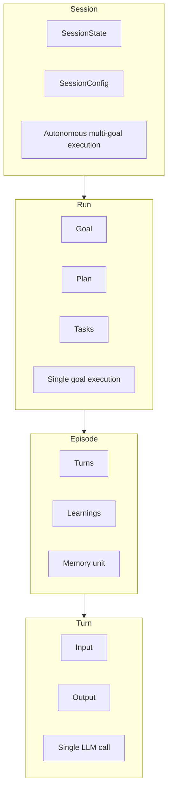
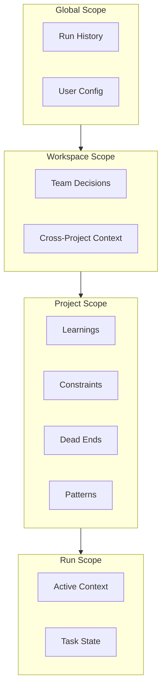
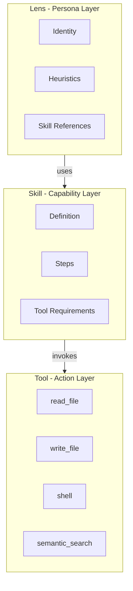
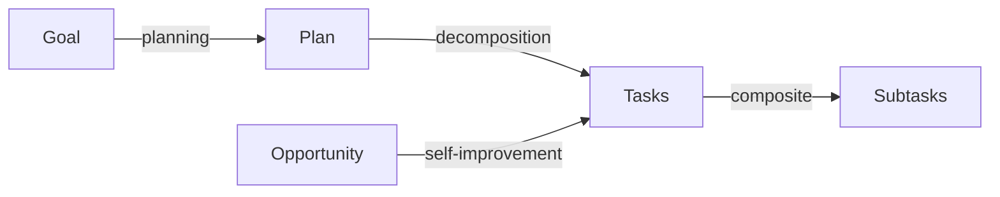
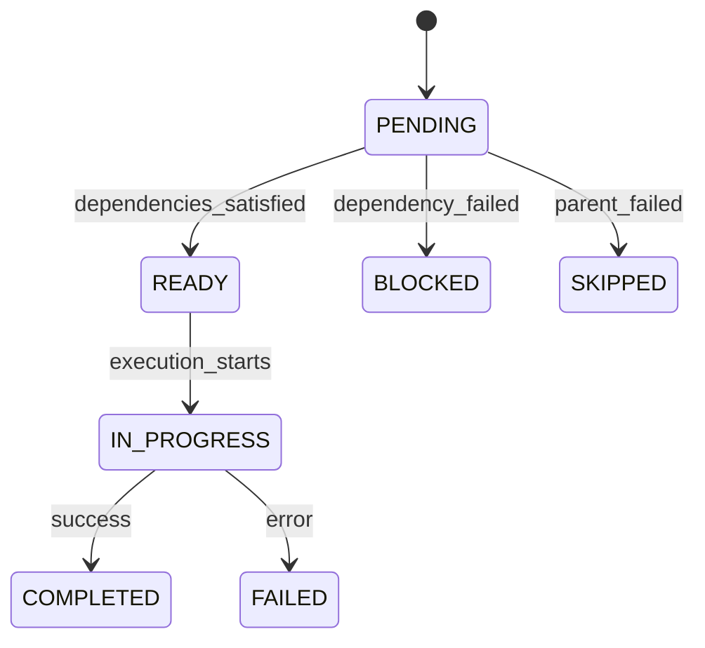

# Sunwell Mental Models

This document defines the core mental models in Sunwell's architecture. It serves as the canonical reference for understanding how concepts relate, what persists where, and how different components interact.

## Overview

Sunwell's architecture has five key conceptual areas:

1. **Execution Hierarchy** - How work is organized (Session > Run > Episode > Turn)
2. **Memory Scoping** - What persists and where
3. **Lens / Skill / Tool** - The capability stack
4. **Goal Decomposition** - How user intent becomes executable work
5. **Trust Levels** - Security and permission model

---

## 1. Execution Hierarchy

Sunwell organizes work in a nested hierarchy from long-running autonomous sessions down to individual LLM calls.



### Definitions

| Concept | Definition | Persistence | Example |
|---------|------------|-------------|---------|
| **Session** | Long-running autonomous execution that processes multiple goals | `~/.sunwell/sessions/` | "Improve test coverage for 8 hours" |
| **Run** | Single goal execution from start to completion | `~/.sunwell/runs/{run_id}/` | "Add user authentication" |
| **Episode** | A coherent unit of memory within a run | In-memory, extracted to project memory | Planning phase, execution phase |
| **Turn** | Single LLM request/response cycle | Part of episode | One tool call + response |

### Key Types

**Session** (`planning/naaru/types.py`):
```python
@dataclass
class SessionState:
    session_id: str
    config: SessionConfig
    status: SessionStatus  # INITIALIZING, RUNNING, PAUSED, COMPLETED, FAILED
    opportunities: list[Opportunity]
    completed: list[CompletedTask]
```

**Run** (`interface/server/run_store.py`):
- Stored as JSON in `~/.sunwell/runs/{run_id}/`
- Contains goal, plan, task history, and execution state
- Linked to a project via `project_id`

**Turn** (`memory/simulacrum/core/turn.py`):
- Input: user message or tool result
- Output: assistant response or tool call
- Metadata: timestamps, token counts, model used

### Relationships

- A **Session** contains zero or more **Runs** (one per goal)
- A **Run** contains one or more **Episodes** (planning, execution phases)
- An **Episode** contains one or more **Turns**
- **Memory extraction** happens at Episode boundaries
- **Checkpointing** happens at Session level

---

## 2. Memory Scoping

Memory in Sunwell has different scopes depending on what it represents and how broadly it should be shared.



### Memory Types and Locations

| Memory Type | Scope | Location | Description |
|-------------|-------|----------|-------------|
| **Learnings** | Project | `.sunwell/memory/` | Facts learned from past executions |
| **Constraints** | Project | `.sunwell/memory/` | Decisions NOT to do something ("Don't use Redis") |
| **Dead Ends** | Project | `.sunwell/memory/` | Approaches that failed ("Async SQLAlchemy caused issues") |
| **Patterns** | Project | `.sunwell/memory/` | Style preferences ("Use snake_case") |
| **Team Decisions** | Workspace | `~/.sunwell/workspaces/{id}/memory/` | Cross-project standards |
| **Run History** | Global | `~/.sunwell/runs/` | All past runs across projects |
| **User Config** | Global | `~/.sunwell/config.toml` | User preferences |

### Memory Context Types

**MemoryContext** - Used during planning (`memory/core/types.py`):
```python
@dataclass
class MemoryContext:
    learnings: tuple[Any, ...]      # Facts from past executions
    facts: tuple[str, ...]          # Extracted codebase facts
    constraints: tuple[str, ...]    # What NOT to do
    dead_ends: tuple[str, ...]      # Failed approaches
    team_decisions: tuple[str, ...] # Team standards
    patterns: tuple[str, ...]       # Style preferences
```

**TaskMemoryContext** - Used during execution:
```python
@dataclass
class TaskMemoryContext:
    constraints: tuple[str, ...]  # Constraints for this file/path
    hazards: tuple[str, ...]      # Past failures with similar tasks
    patterns: tuple[str, ...]     # Style patterns for this task type
```

### Memory Flow

1. **Run starts** → Load project memory into `MemoryContext`
2. **Planning** → Memory informs plan generation (constraints, dead ends)
3. **Execution** → Task-specific memory loaded as `TaskMemoryContext`
4. **Run completes** → New learnings extracted and persisted
5. **Episode boundary** → Memory compression and extraction

---

## 3. Lens / Skill / Tool Hierarchy

Sunwell's capability stack has three layers: Lenses define persona, Skills define reusable capabilities, and Tools provide concrete actions.



### Definitions

| Concept | Definition | Format | Location |
|---------|------------|--------|----------|
| **Lens** | A persona with identity, heuristics, and skill set | `.lens` file | `lenses/` |
| **Skill** | A reusable capability with defined steps | `.yaml` file | `skills/` |
| **Tool** | A concrete action the agent can perform | Python class | `tools/` |

### Lens Structure

A Lens defines WHO the agent is for a task (`planning/lens/identity.py`):

```yaml
# Example: api-documenter-v2.lens
identity:
  name: "API Documenter"
  domain: "documentation"
  
heuristics:
  - "Always include usage examples"
  - "Document edge cases and error conditions"
  
skills:
  - "extract-api-signatures"
  - "generate-docstrings"
```

**LensManifest** contains:
- `identity` - UUID, URI, display name
- `lineage` - Fork tracking (forked_from, forked_at)
- `versions` - Version history with content hashes
- `domain` - Category (documentation, code-review, etc.)
- `heuristics_count`, `skills_count` - For UI display

### Skill Structure

A Skill defines WHAT can be done (`planning/skills/types.py`):

```yaml
# Example: extract-api-signatures.yaml
name: "Extract API Signatures"
description: "Extract public API signatures from source files"

steps:
  - action: "find_files"
    pattern: "**/*.py"
  - action: "extract_signatures"
    type: "public_only"
    
tools_required:
  - "read_file"
  - "semantic_search"
```

### Tool Structure

A Tool defines HOW to perform an action (`tools/core/types.py`):

- **read_file** - Read file contents
- **write_file** - Write/create files
- **shell** - Execute shell commands
- **semantic_search** - Search codebase by meaning
- **grep** - Pattern-based search

### Relationships

1. **Lens activates Skills** - A lens specifies which skills it can use
2. **Skills compose Tools** - A skill defines steps that invoke tools
3. **Tools are atomic** - Tools don't know about skills or lenses
4. **Trust gates Tools** - Trust level determines which tools are available

---

## 4. Goal Decomposition

User intent flows through a pipeline that transforms it into executable work.



### Definitions

| Concept | Definition | Source |
|---------|------------|--------|
| **Goal** | User's high-level intent | User input |
| **Plan** | Strategy to achieve the goal | Planner output |
| **Task** | Executable unit of work | Plan decomposition |
| **Opportunity** | Self-improvement suggestion | Analysis |

### Task Modes

Tasks have a `TaskMode` that determines execution strategy (`planning/naaru/types.py`):

| Mode | Description | Example |
|------|-------------|---------|
| `SELF_IMPROVE` | Modify Sunwell's own code | "Fix planning bug" |
| `GENERATE` | Create new files/content | "Create user model" |
| `MODIFY` | Modify existing files | "Add validation to handler" |
| `EXECUTE` | Run commands | "Run tests" |
| `RESEARCH` | Gather information (no side effects) | "Find all API endpoints" |
| `COMPOSITE` | Multi-step with subtasks | "Implement auth feature" |

### Task Structure

```python
@dataclass
class Task:
    id: str
    description: str
    mode: TaskMode
    
    # Dependencies
    depends_on: tuple[str, ...]     # Task IDs that must complete first
    subtasks: tuple[Task, ...]      # For composite tasks
    
    # Contract-aware (RFC-034)
    produces: frozenset[str]        # Artifacts this creates
    requires: frozenset[str]        # Artifacts needed before running
    modifies: frozenset[str]        # Resources touched (conflict detection)
    
    # Execution
    status: TaskStatus              # PENDING, READY, IN_PROGRESS, COMPLETED, FAILED
    tools: frozenset[str]           # Tools this task may use
```

### Task Status Flow



### Opportunity vs Task

- **Opportunity** is a discovered self-improvement suggestion
- **Task** is the general work unit
- Opportunities become Tasks when scheduled for execution
- Both share the same execution infrastructure

---

## 5. Trust Levels

Trust levels control what the agent can do within a project.

### Trust Matrix

| Trust Level | Read Files | Write Files | Shell | Network | Use Case |
|-------------|------------|-------------|-------|---------|----------|
| `discovery` | Yes | No | No | No | Exploring unknown codebase |
| `read_only` | Yes | No | No | No | Code review, analysis |
| `workspace` | Yes | Project only | No | No | Normal development |
| `shell` | Yes | Project only | Yes | No | Build/test execution |
| `full` | Yes | Anywhere | Yes | Yes | Full automation |

### Trust Configuration

Trust is configured per-project in `.sunwell/project.toml`:

```toml
[agent]
trust = "workspace"  # Default trust level
protected = [".git", "node_modules", "__pycache__"]  # Never modify these
```

### Trust Resolution

Trust level is resolved with precedence (`knowledge/workspace/detector.py`):

1. **CLI flag** (`--trust`) - Highest precedence
2. **Config file** (`.sunwell/config.yaml`) - Project-level setting
3. **Default** - `workspace` (safe default)

```python
def resolve_trust_level(
    explicit_trust: str | None,  # From CLI
    config: WorkspaceConfig,     # From detection
) -> str:
    if explicit_trust:
        return explicit_trust.lower()
    if config.config_trust:
        return config.config_trust
    return DEFAULT_TRUST  # "workspace"
```

### Trust in Multi-Project Workspaces

When working with workspace containers (multiple projects):

- Each project maintains its own trust level
- Workspace-level operations use the **minimum** trust of all projects
- Cross-project queries respect individual project trust
- Trust can be elevated per-run but not persisted

---

## Common Scenarios

### Scenario 1: Starting a New Feature

```
User: "Add user authentication"

1. Goal received: "Add user authentication"
2. Memory loaded: MemoryContext with project constraints/patterns
3. Plan generated: Strategy with tasks
4. Tasks created:
   - Task 1: Research existing auth patterns (RESEARCH)
   - Task 2: Create User model (GENERATE)
   - Task 3: Create auth middleware (GENERATE)
   - Task 4: Add login endpoint (MODIFY)
   - Task 5: Run tests (EXECUTE)
5. Execution: Tasks run in dependency order
6. Memory updated: New learnings persisted
```

### Scenario 2: Resuming a Paused Session

```
User: "Resume previous session"

1. SessionState loaded from ~/.sunwell/sessions/
2. Last checkpoint restored (opportunities, completed tasks)
3. Current task identified (was IN_PROGRESS)
4. Run context restored from ~/.sunwell/runs/{run_id}/
5. Project memory loaded
6. Execution continues from checkpoint
```

### Scenario 3: Multi-Project Query

```
User: "How does auth work?" (in workspace with frontend + backend)

1. Query router analyzes: "auth" suggests backend
2. L1 signature index searched across workspace
3. Backend project identified as primary target
4. Full index (L2) loaded for backend
5. Results returned with cross-project context
6. Frontend references included if relevant
```

### Scenario 4: Applying a Lens

```
User: Selects "API Documenter" lens

1. Lens loaded from lenses/api-documenter-v2.lens
2. Skills activated: extract-api-signatures, generate-docstrings
3. Heuristics injected into planning prompt
4. Tools gated by lens requirements
5. Output follows lens-defined patterns
```

### Scenario 5: Memory Extraction After Run

```
Run completes: "Add caching to API"

1. Episode ends → memory extraction triggered
2. Learnings extracted:
   - "Redis connection pooling improves performance"
   - "Cache TTL should match session timeout"
3. Constraints captured:
   - "Don't cache user-specific data without key isolation"
4. Patterns detected:
   - "Use @cached decorator for idempotent endpoints"
5. Memory persisted to .sunwell/memory/
6. Available for future runs in this project
```

### Scenario 6: Trust Level Override

```
User: "Run the deployment script" (project trust = workspace)

1. Task requires shell execution
2. Current trust (workspace) doesn't allow shell
3. Options presented:
   a. Run with --trust=shell flag
   b. Update .sunwell/project.toml to trust=shell
   c. Skip this task
4. User chooses --trust=shell
5. Trust elevated for THIS RUN ONLY
6. Deployment script executes
7. Trust reverts to workspace for next run
```

### Scenario 7: Failed Task Recovery

```
Task 3 of 5 fails: "Create auth middleware"

1. Task status → FAILED
2. Error captured: "Module 'jwt' not found"
3. Dead end recorded: "jwt library not installed"
4. Dependent tasks (4, 5) → SKIPPED
5. Recovery options:
   a. Fix and retry (install jwt, re-run task 3)
   b. Revise plan (use different auth approach)
   c. Abort run (preserve learnings)
6. If fixed: Task 3 → PENDING → READY → IN_PROGRESS
7. Downstream tasks unblocked
```

---

## Quick Reference

### Directory Structure

```
~/.sunwell/
├── config.toml              # Global user config
├── workspaces/              # Workspace definitions (TOML)
│   └── {workspace_id}.toml
├── runs/                    # Run history (JSON)
│   └── {run_id}/
├── sessions/                # Session checkpoints
│   └── {session_id}/
└── projects.json            # Project registry

~/Sunwell/projects/{project}/
└── .sunwell/
    ├── project.toml         # Project config
    ├── memory/              # Project memory
    └── index/               # Codebase index
```

### Key Files

| File | Purpose |
|------|---------|
| `planning/naaru/types.py` | Task, Session, Opportunity types |
| `memory/core/types.py` | MemoryContext, TaskMemoryContext |
| `planning/lens/identity.py` | LensManifest, LensLineage |
| `knowledge/project/types.py` | Project, AgentConfig |
| `knowledge/workspace/types.py` | Workspace, WorkspaceProject |
| `interface/server/run_store.py` | Run persistence |
